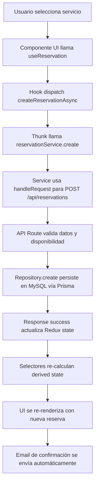
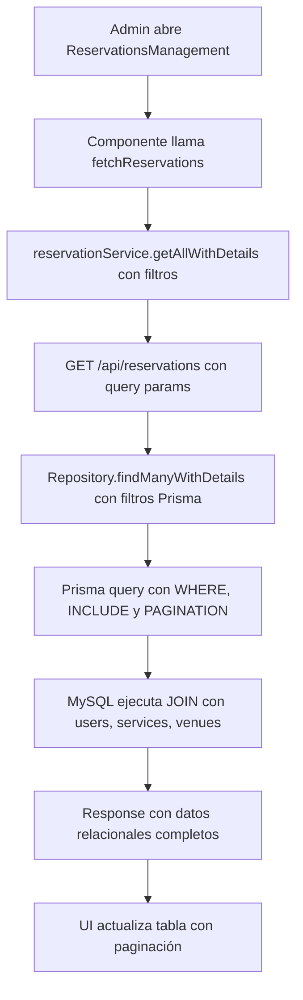
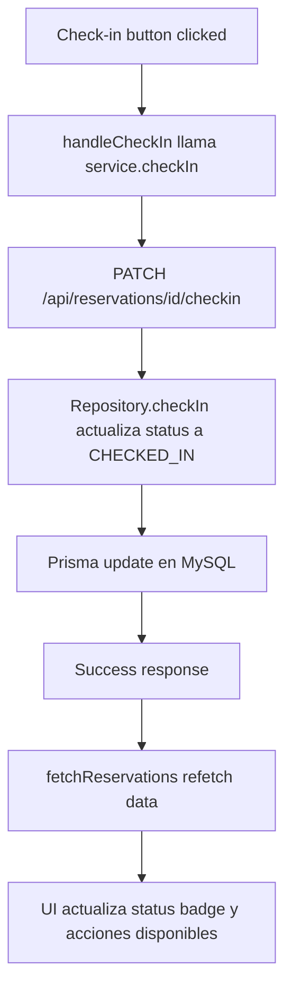

# Flujo Completo del Contexto de Reservas

## Descripción General

Este documento explica el flujo completo de datos para el contexto de **Reservas** en ReservaApp, desde que nace en la API hasta llegar a la UI, incluyendo todos los componentes arquitectónicos involucrados y cómo se interconecta con otros contextos del sistema.

## Arquitectura del Contexto de Reservas

### 1. Base de Datos - Prisma Schema

**Ubicación**: `prisma/schema.prisma`

El modelo de datos central para las reservas:

```prisma
model Reservation {
  id             String            @id @default(cuid())
  confirmationId String            @unique @default(cuid())
  status         ReservationStatus @default(PENDING)
  checkInDate    DateTime
  checkOutDate   DateTime
  guests         Int               @default(1)
  totalAmount    Decimal           @db.Decimal(10, 2)
  currency       String            @default("MXN")
  notes          String?           @db.Text
  specialRequests String?          @db.Text
  metadata       Json?
  createdAt      DateTime          @default(now())
  updatedAt      DateTime          @updatedAt

  // Relations
  user      User      @relation(fields: [userId], references: [id])
  userId    String
  venue     Venue     @relation(fields: [venueId], references: [id])
  venueId   String
  service   Service   @relation(fields: [serviceId], references: [id])
  serviceId String
  payments  Payment[]

  @@map("reservations")
}

enum ReservationStatus {
  PENDING
  CONFIRMED
  CHECKED_IN
  CHECKED_OUT
  CANCELLED
  NO_SHOW
}
```

**Características:**
- **Relaciones**: Se conecta con User, Venue, Service y Payment
- **Estados**: Manejo de flujo de estados desde PENDING hasta CHECKED_OUT
- **Metadatos**: Campo JSON flexible para datos adicionales
- **Railway MySQL**: Hospedado en Railway con conexión via DATABASE_URL

### 2. Repositorio de Datos - Repository Pattern

**Ubicación**: `src/libs/data/repositories/ReservationRepository.ts`

Capa de acceso a datos que implementa el patrón Repository:

```typescript
class ReservationRepository {
  private prisma: PrismaService;

  // Operaciones CRUD principales
  async create(data: CreateReservationData): Promise<Reservation>
  async findById(id: string): Promise<Reservation | null>
  async findByIdWithDetails(id: string): Promise<ReservationWithDetails | null>
  async findMany(filters: ReservationFilters, pagination): Promise<{reservations: Reservation[], total: number}>
  async findManyWithDetails(filters: ReservationFilters, pagination): Promise<{reservations: ReservationWithDetails[], total: number}>
  async update(id: string, data: UpdateReservationData): Promise<Reservation>
  async cancel(id: string): Promise<Reservation>
  async checkIn(id: string): Promise<Reservation>
  async checkOut(id: string): Promise<Reservation>
  async delete(id: string): Promise<Reservation>
  
  // Operaciones especializadas
  async getReservationStats(venueId?: string, dateFrom?: Date, dateTo?: Date): Promise<ReservationStats>
  async getUpcomingCheckIns(venueId?: string, days: number = 7): Promise<ReservationWithDetails[]>
  async getUpcomingCheckOuts(venueId?: string, days: number = 7): Promise<ReservationWithDetails[]>
  async findByUserAndDateRange(userId: string, checkIn: Date, checkOut: Date): Promise<Reservation[]>
}
```

**Características:**
- **Singleton Instance**: `reservationRepository` exportado globalmente
- **Error Handling**: Manejo específico de errores Prisma
- **Relaciones**: Include automático para datos relacionados (user, service, venue, payments)
- **Filtros Avanzados**: Búsqueda por texto, fechas, estados, venues
- **Paginación**: Soporte nativo con límites y páginas
- **Validaciones**: Verificación de overlapping de fechas y disponibilidad

### 3. API Routes - Next.js App Router

**Ubicación**: `src/app/api/reservations/`

Endpoints RESTful que exponen la funcionalidad:

#### 3.1 Endpoint Principal - `/api/reservations`

**GET** - Listar reservas con filtros y paginación:
```typescript
// Parámetros query disponibles
interface QueryParams {
  userId?: string;
  serviceId?: string;
  venueId?: string;
  status?: ReservationStatus;
  checkIn?: string;
  checkOut?: string;
  dateFrom?: string;
  dateTo?: string;
  search?: string;
  page?: number;
  limit?: number;
  includeDetails?: boolean;
}
```

**POST** - Crear nueva reserva:
```typescript
// Body requerido
interface CreateReservationBody {
  userId: string;
  serviceId: string;
  checkIn: string;
  checkOut: string;
  guestCount: number;
  specialRequests?: string;
  metadata?: Record<string, any>;
}
```

**Validaciones:**
- Verificación de fechas válidas (check-in antes que check-out)
- Validación de disponibilidad del servicio
- Cálculo automático de precio total
- Verificación de capacidad

#### 3.2 Endpoint por ID - `/api/reservations/[id]`

**GET** - Obtener reserva específica
**PUT** - Actualizar reserva
**DELETE** - Eliminar reserva

#### 3.3 Endpoints de Acciones - `/api/reservations/[id]/[action]`

- **PATCH** `/api/reservations/[id]/cancel` - Cancelar reserva
- **PATCH** `/api/reservations/[id]/checkin` - Check-in
- **PATCH** `/api/reservations/[id]/checkout` - Check-out

**Respuesta Estandarizada:**
```typescript
interface ApiResponse<T> {
  success: boolean;
  message: string;
  data?: T;
  error?: string;
  timestamp: string;
}
```

### 4. Capa de Servicios - Service Layer

**Ubicación**: `src/libs/services/api/reservationService.ts`

Servicio que encapsula las llamadas HTTP usando el patrón HandleRequest:

```typescript
class ReservationService {
  private baseUrl = '/api/reservations';

  // Métodos principales
  async getAll(filters: ReservationFilters, pagination): Promise<PaginatedResponse<Reservation>>
  async getAllWithDetails(filters: ReservationFilters, pagination): Promise<PaginatedResponse<ReservationWithDetails>>
  async getById(id: string): Promise<Reservation>
  async getByIdWithDetails(id: string): Promise<ReservationWithDetails>
  async create(data: CreateReservationData): Promise<Reservation>
  async update(id: string, data: UpdateReservationData): Promise<Reservation>
  async cancel(id: string): Promise<Reservation>
  async checkIn(id: string): Promise<Reservation>
  async checkOut(id: string): Promise<Reservation>
  async delete(id: string): Promise<void>
  
  // Métodos especializados
  async getStats(venueId?: string, dateFrom?: string, dateTo?: string): Promise<ReservationStats>
  async getUserReservations(userId: string, filters, pagination): Promise<PaginatedResponse<ReservationWithDetails>>
  async getVenueReservations(venueId: string, filters, pagination): Promise<PaginatedResponse<ReservationWithDetails>>
  async getServiceReservations(serviceId: string, filters, pagination): Promise<PaginatedResponse<ReservationWithDetails>>
  async searchReservations(query: string, filters, pagination): Promise<PaginatedResponse<ReservationWithDetails>>
  async addReview(id: string, rating: number, review: string): Promise<Reservation>
}
```

**Patrón HandleRequest:**
- **Error Handling**: Manejo centralizado de errores HTTP
- **Auth Injection**: Inyección automática de tokens JWT
- **Type Safety**: Tipado completo de requests/responses
- **Timeout Management**: Configuración de timeouts por request

### 5. Redux Store - Estado Global

**Ubicación**: `src/libs/core/state/slices/reservation.slice.ts`

#### 5.1 Estado de la Slice

```typescript
interface ReservationState extends BaseState {
  currentReservation: Partial<Reservation> | null;
  reservations: Reservation[];
  selectedDates: {
    checkIn: string | null;
    checkOut: string | null;
  };
  guestInfo: {
    primaryGuest: Partial<Guest>;
    additionalGuests: Partial<Guest>[];
  };
  paymentDetails: PaymentDetails | null;
  bookingStep: 'dates' | 'services' | 'guests' | 'payment' | 'confirmation';
}
```

#### 5.2 Async Thunks

```typescript
// Thunks para operaciones asíncronas
export const createReservationAsync = createAsyncThunk(...)
export const fetchUserReservationsAsync = createAsyncThunk(...)
export const cancelReservationAsync = createAsyncThunk(...)
export const processPaymentAsync = createAsyncThunk(...)
```

#### 5.3 Reducers Síncronos

```typescript
// Acciones síncronas para UI state
setSelectedDates, clearSelectedDates
setCurrentReservation, clearCurrentReservation
updateGuestInfo, addAdditionalGuest, removeAdditionalGuest
setBookingStep
reservationReset, reservationErrorReset
```

### 6. Selectores - Derived State

**Ubicación**: `src/libs/core/state/selectors/reservation.selector.ts`

Selectores optimizados con memoización para derivar estado:

```typescript
// Selectores básicos
export const selectCurrentReservation
export const selectReservations
export const selectSelectedDates
export const selectGuestInfo
export const selectPaymentDetails
export const selectBookingStep

// Selectores computados
export const selectTotalGuests
export const selectHasValidDates
export const selectNumberOfNights
export const selectIsPrimaryGuestComplete
export const selectCanProceedToNextStep
export const selectReservationTotals

// Selectores de filtrado
export const selectActiveReservations
export const selectPendingReservations
export const selectUpcomingReservations
export const selectReservationsByStatus(status)
export const selectReservationById(id)

// Selectores de validación
export const selectIsCheckInDateValid
export const selectIsCheckOutDateValid
```

**Características:**
- **Memoización**: Uso de `createSelector` para performance
- **Derived State**: Cálculos complejos derivados del estado base
- **Type Safety**: Tipado completo con TypeScript

### 7. Custom Hooks - React Integration

**Ubicación**: `src/libs/presentation/hooks/useReservation.ts`

Hook personalizado que integra Redux con componentes React:

```typescript
export const useReservation = () => {
  // Selectores de estado
  const currentReservation = useAppSelector(selectCurrentReservation);
  const reservations = useAppSelector(selectReservations);
  const selectedDates = useAppSelector(selectSelectedDates);
  // ... más selectores

  // Action dispatchers
  const createReservation = useCallback(async (data) => {
    return dispatch(createReservationAsync(data)).unwrap();
  }, [dispatch]);

  // Navigation helpers
  const goToNextStep = useCallback(() => { ... }, []);
  const goToPreviousStep = useCallback(() => { ... }, []);

  // Validation helpers
  const validateCurrentStep = useCallback(() => { ... }, []);
  const getStepProgress = useCallback(() => { ... }, []);

  return {
    // State
    currentReservation, reservations, selectedDates, guestInfo, 
    // Actions
    createReservation, cancelReservation, processPayment,
    // Helpers
    goToNextStep, goToPreviousStep, validateCurrentStep
  };
};
```

**Características:**
- **Abstraction Layer**: Abstrae la complejidad de Redux
- **Memoized Callbacks**: Previene re-renders innecesarios
- **Business Logic**: Incluye lógica de negocio específica de reservas

### 8. Componentes UI - Presentation Layer

#### 8.1 Componente de Administración

**Ubicación**: `src/modules/mod-admin/presentation/components/ReservationsManagement.tsx`

```typescript
export const ReservationsManagement: React.FC = () => {
  // Estado local para filtros UI
  const [statusFilter, setStatusFilter] = useState<string>('all');
  const [dateFilter, setDateFilter] = useState('');
  const [searchTerm, setSearchTerm] = useState('');
  const [reservations, setReservations] = useState<ReservationWithDetails[]>([]);
  
  // Uso directo del servicio (no Redux en admin)
  const fetchReservations = async () => {
    const response = await reservationService.getAllWithDetails(filters, pagination);
    setReservations(response.reservations);
  };

  // Handlers para acciones
  const handleCancel = async (id: string) => {
    await reservationService.cancel(id);
    fetchReservations();
  };

  const handleCheckIn = async (id: string) => {
    await reservationService.checkIn(id);
    fetchReservations();
  };
```

**Características:**
- **Estado Local**: No usa Redux, maneja estado local
- **Servicio Directo**: Llamadas directas a reservationService
- **Filtros Avanzados**: Filtrado por estado, fecha, búsqueda
- **Acciones CRUD**: Create, Update, Delete, Cancel, Check-in, Check-out
- **Paginación**: Soporte nativo de paginación
- **Styled Components**: Consistencia con design system

#### 8.2 Componentes de Usuario (Booking Flow)

Aunque no están implementados completamente, el diseño Redux está preparado para:

```typescript
// Componente de selección de fechas
const DateSelection = () => {
  const { setDates, selectedDates, hasValidDates } = useReservation();
  // ...
};

// Componente de información de huéspedes
const GuestInformation = () => {
  const { updateGuests, addGuest, removeGuest, guestInfo } = useReservation();
  // ...
};

// Componente de pago
const PaymentSection = () => {
  const { processPayment, paymentDetails } = useReservation();
  // ...
};
```

## Interconexión con Otros Contextos

### 1. Integración con Contexto de Usuarios

**Flujo de Datos:**
```
User Authentication → JWT Token → API Header → Reservation Create/Update
```

**Selectores Compartidos:**
- `selectCurrentUser` - Para obtener userId automáticamente
- `selectUserRole` - Para permisos de acceso a endpoints admin

### 2. Integración con Contexto de Servicios

**Repository Dependencies:**
```typescript
// En ReservationRepository.create()
const service = await serviceRepository.findById(serviceId);
const serviceAvailable = await serviceRepository.checkAvailability(
  serviceId, checkInDate, checkOutDate, guestCount
);
```

**Cálculo de Precios:**
- Obtiene precio base del servicio
- Calcula total por noches/duración
- Aplica multiplicador por huéspedes

### 3. Integración con Contexto de Venues

**Relaciones de Base de Datos:**
```typescript
// Include automático en findManyWithDetails
service: {
  venue: {
    select: {
      id: true, name: true, category: true, address: true
    }
  }
}
```

**Filtros por Venue:**
- Permite filtrar reservas por venue específico
- Estadísticas por venue individual

### 4. Integración con Contexto de Pagos

**Stripe Integration Flow:**
```
Reservation Creation → Payment Intent → Stripe Processing → Payment Confirmation → Reservation Status Update
```

**Estado Sincronizado:**
```typescript
// En reservation.slice.ts
paymentDetails: PaymentDetails | null;
paymentStatus: 'pending' | 'processing' | 'paid' | 'failed' | 'refunded';
```

### 5. Integración con Servicios Externos

#### 5.1 Email Notifications (Resend)

**Triggers Automáticos:**
```typescript
// POST /api/reservations - Nueva reserva
await ResendService.sendReservationConfirmation(emailData);

// PATCH /api/reservations/[id]/cancel - Cancelación
await ResendService.sendReservationCancellation(emailData);

// Stripe webhook - Pago confirmado
await ResendService.sendPaymentConfirmation(emailData);
```

#### 5.2 Image Management (Cloudinary)

**Service Images:**
```typescript
// En la respuesta de getAllWithDetails
service: {
  images: ['cloudinary_url_1', 'cloudinary_url_2'],
  venue: {
    images: ['venue_cloudinary_url']
  }
}
```

## Flujo Completo de Datos

### 1. Flujo de Creación de Reserva



### 2. Flujo de Consulta con Filtros



### 3. Flujo de Actualización de Estado



## Performance y Optimizaciones

### 1. Base de Datos
- **Indexes**: Índices en userId, serviceId, venueId, checkInDate, status
- **Paginación**: Límites predeterminados (50 items max)
- **Projections**: Select específicos para evitar over-fetching

### 2. Redux
- **Memoized Selectors**: `createSelector` previene re-cálculos
- **Normalized State**: IDs como keys para actualizaciones eficientes
- **Selective Updates**: Solo componentes suscritos se re-renderizan

### 3. API
- **Caching Headers**: Cache-Control para datos relativamente estáticos
- **Compression**: Gzip automático en Vercel
- **Error Boundaries**: Manejo centralizado de errores

### 4. Frontend
- **Code Splitting**: Lazy loading de componentes admin
- **Bundle Optimization**: Tree-shaking de librerías no utilizadas
- **Image Optimization**: Cloudinary para transformaciones dinámicas

## Consideraciones de Seguridad

### 1. API Protection
- **JWT Validation**: Verificación de tokens en endpoints protegidos
- **Role-based Access**: Permisos específicos por rol de usuario
- **Rate Limiting**: Prevención de abuso de API

### 2. Data Validation
- **Input Sanitization**: Validación de todos los inputs
- **SQL Injection Prevention**: Prisma ORM automáticamente previene
- **XSS Protection**: Sanitización de contenido user-generated

### 3. Business Logic
- **Double Booking Prevention**: Verificación de overlapping dates
- **Capacity Validation**: No exceder capacidad del servicio
- **Payment Security**: Integración segura con Stripe

Este flujo completo demuestra cómo el contexto de Reservas integra todas las capas de la arquitectura, desde la base de datos hasta la UI, manteniendo separación de responsabilidades y alta cohesión dentro de cada módulo.